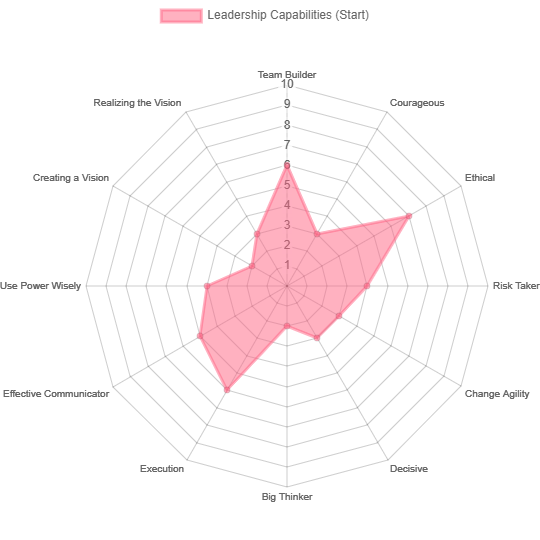
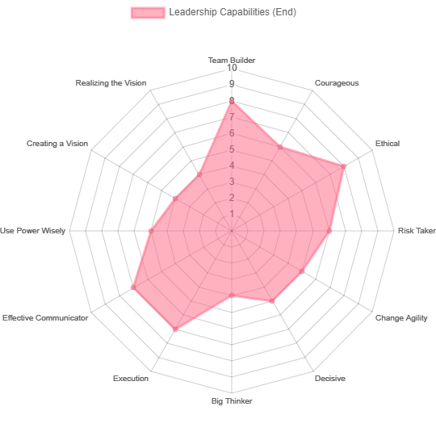

A reflection of my time participating in my school's Leadership Program. **TL;DR at the end.**

## Project Summary
The Hornet Leadership Program is an opportunity provided by my university for STEM students. The purpose of the Hornet Leadership Program is to develop students with importnat leadership skills and to connect students with members of the STEM community in the greater Sacramento region. 

## Project Requiremnets
* Attend seminars
* Make meaningful connections with classmates and guest speakers

## Project Thoughts
The outcome of this project is to gain in-demand skills that employers want by completing the 15-week course. Overall the course was enjoyable, inspirational, and educational. The course was structured in a way where we would learn a different topic/skill every week, with guest speakers sprinkled throughout the course. 

The most impactful part of the course was the self-assessment that we did before and after the course. The assessments allowed us to reflect and see our improvement over the course of the 15 weeks. Below you can see how I thought I improved and what my key takeaways for each week were.

## Key Takeaways Week-by-week Topics

1. Overview of Leadership
    * Key takeaway(s): To be a capable engineering leader you must have both engineering skills (technical expertise) and leadership skills (the ability to influence and inspire).
2. Career Success Factors
    * Key takeaway(s): Know your own values and align yourself with a company that has similar Vision, Mission, Value, and Culture.
3. Effective Leadership Styles
    * Key takeaway(s): The most effective leadership is situational. Good leaders can adapt their leadership styles. Example of common leadership styles are “Delegator” or “Director”.
4. Reflection and Personal Development Plan
    * Key takeaway(s): A good leader is self aware. They should understand their own values, strengths, and weaknesses. Good way to understand yourself is through self reflection, MBTI Personality Types, or DISC Exercises. 
5. Big Picture/Systems Thinking
    * Key takeaway(s): Never jump to conclusions. Practice critical thinking by testing conclusions, assumptions, and observations. Be reflective, unbiased, and open-minded. A useful model of critical thinking is to examine issue, set criteria, gather information, and reach a conclusion.
6. Ethical Leadership
    * Key takeaway(s): Ethics is a structured system of principles that governs a group, this is important for leader because leadership involves influencing others. There are five major principles to consider for ethical decision making. The principles are “Respects Others”, “Serves Others”, “Shows Justice”, “Manifests Honesty”, and “Builds Community”.
7. Courage Building
    * Key takeaway(s): Shame and vulnerability is not a weakness. If you are not vulnerable you will not be able to trust yourself or your team.
8. Team Building
    * Key takeaway(s): The five stages of team development where “storming” (conflicts and disagreements) is part of the team building process. Conflict resolution skills and fostering diverse/inclusive environment is important.
9. Innovation & Risk Taking
    * Key takeaway(s): The Innovation Matrix and SWOT Analysis are important tools for innovation and risk taking. 
10. Change Agility & Management
    * Key takeaway(s): The 3-step change model by Lewin will help with assisting whether we need to change something and how to pivot as needed.
11. Decisiveness & Using Power Wisely
    * Key takeaway(s): Use a Pugh or Decision Matrix to make effective decisions.
12. Execution
    * Key takeaway(s): Leaders need to develop four important behavioral traits which are “persistence”, “perseverance”, “resilience”, and “grit”. Use the most effective project management tool for the job whether that be Gantt Charts, Waterfall, or Agile. 
13. Effective Communication
    * Key takeaway(s): Interpersonal skills are key to effective communication. Develop active listening skills, negotiation skills, presentation skills, and persuasion skills. Structure communication in logical organization and aim for “win-win” situations. 
14. The Social Change Model
    * Key takeaway(s): Leadership is... Value based. Socially responsible. Collaborative. A process, not a position. Inclusive. Accessible to everyone.
15. Discovering Your Authentic Leadership Style
    * Key takeaway(s): More of a summary but... Going more in depth of week 4, to determine our own leadership styles and action plans on how to improve. 
16. Self-Reflection on Growth as a Leader at the end of HLP
    * Key takeaway(s): More of a summary but... Reflection on our course, completing the self assessment that we did and the start of the course. Reflecting on why or why we didn’t improve.

## TL;DR
This 15-week course helped me develop important skill. The self-assessments given during course helped me practice self-reflection, which made it easy for me to visualize my improvements. Additionally, before taking this course I was on the fence about going to study abroad, but some topics and guest speakers inspired me to fully commit.

[You can read about my study abroad experience here.](https://www.jasontuyen.com/posts/study-abroad-seoul/)