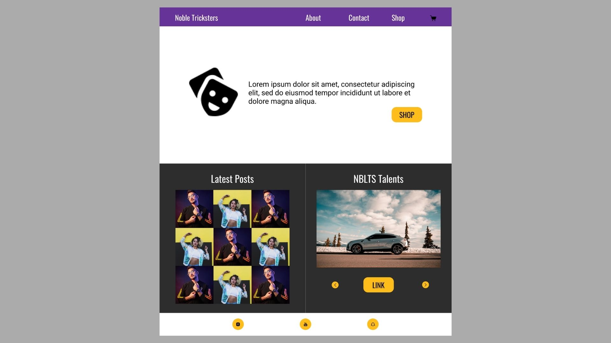
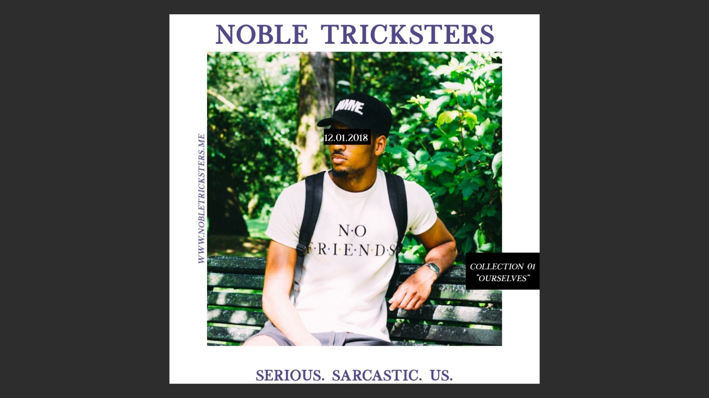

Here's what I learned from creating an online community and clothing business. **TL;DR at the end.**

## Project Summary
Noble Tricksters was an online gaming community founded by my cousins and I back in 2016. We did get-togethers on Discord and created videos for our YouTube channel (I also started learning to edit videos because of this). After our community grew a bit, I decided to start a clothing brand based on our community. The clothing brand no longer exists and our community isn't as active as before, but I thought I would write a post to reflect on what I've learned.

## Project Requirements
The original project came out of nowhere, we just slowly became a big community and eventually decided to give ourselves a group name. Because this wasn't really a planned project there weren't any specific goals and requirements that we were trying to meet. But if I had to choose a main project requirement it would be to grow the community and make sure everyone was having fun.

## Project Thoughts
The Noble Tricksters community was originally united through our similar interests and we definitely wanted to become a community that creates things to bring people together.
The things we ended up creating were YouTube videos and clothing to show that "we are a fun community". And we were a fun community, I really enjoyed our online/offline get-togethers, editing our videos, and running our clothing brand.

Anyways, the Noble Tricksters name was created by forming an oxymoron that reflected our personality. Sometimes we're serious and sometimes we're sarcastic but we're always ourselves. Hence our motto: "Serious. Sarcastic. Us." When the videos and clothing business came around we wanted to expand on this motto we came up with a mission to make people feel comfortable being themselves and pursue what they love. In our case pursuing what we love was creating content.

Creating videos for Noble Tricksters was pretty straightforward. We just got together to play games and then I would edit the interesting parts and put things together. 
[You can click here to go to our YouTube channel and see my editing skills.](https://www.youtube.com/channel/UCUzAAvRtuSh6q2MI3jy52Dw/featured)
As a result I learned how to use Sony Vegas and Adobe Premiere Pro. [Despite no longer making YouTube videos, I continue to put those skills to use.](https://www.youtube.com/channel/UCU8LhZGkKsmXddsQjARLmsA) ***So not only is learning new skills fun but it's also a good way to recieve new opportunities.***

The clothing brand required more work than video creation. The main issue was money, in order to start a clothing brand you need money. 
Being a college student it was hard to find money to fund this project.
But I took the risk because it was a project that I enjoyed.
At the start I was afraid to fail since I put in so much money and effort. 
In the end, I wish I could say this clothing business was successful but it wasn't and I didn't even break even in revenue.
This was probably my first time failing or at least my first time failing with so much resources invested.
***But I was still okay and now I don't really see failure as a bad thing.***

After getting funding the next steps was to find suppliers and market the product.
Finding suppliers required me to search for suppliers within my budget and still good quality. 
I also needed to find a designer that could match our vision. 
I ended up finding the suppliers and designers by asking friends for suggestions.
***Communication skills, networking, and not being afraid to ask for help is how I got through this step.***

The next step was sharing/marketing my products. I created a website using Wordpress and Elementor that I can lead people to see and buy our clothes. 
Unfortunately, I no longer have the code or a screenshot of the original Noble Tricksters Website.
***Which leads me to this piece of wisdom: keep good documentation!***

However, I did make a quick mockup on Figma. It's based on the few things that I did make notes of and what I remember the website used to look like.
I noted down the HEX code colors originally used (purple, gold, and gray) and the two fonts (Oswald and Roboto). I also recalled that our homepage had our logo next to a call-to-action button that led to our shop page. The remainder of the homepage had 2 major sections: an Instagram posts widget and a section dedicated to things our members made (such as art, music, videos, etc). Aside from the homepage and shop page, we also had the about page and contact page. 

Since I'm posting photos, here one of the ads that I made for our business using Adobe Photoshop

## TL;DR
Because of challenges and failures, I learned that:
* In my opinion Sony Vegas is easier than Premiere Pro but the latter is more popular. 
* Always stay learning because it can lead to opportunities.
* Failure isn't the end of the world.
* Don't be afraid to ask for help.
* Work on communication and networking skills. 
* Wordpress and Elementor can help you get a website up and running quickly.
* Get into the habit of documenting (this is why I decided to make project/blog posts)