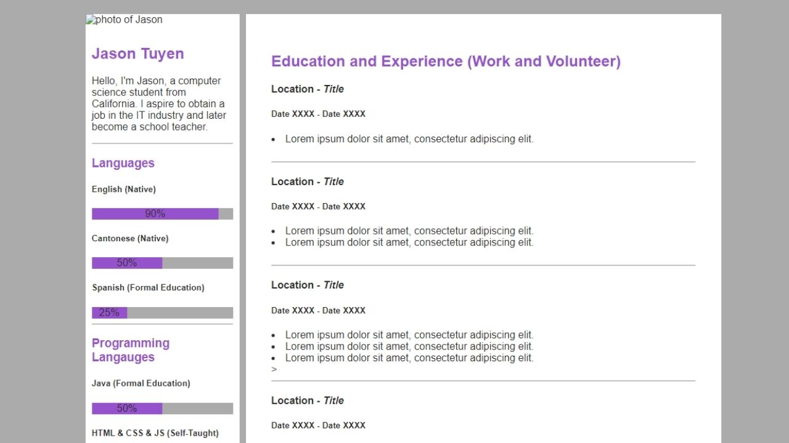
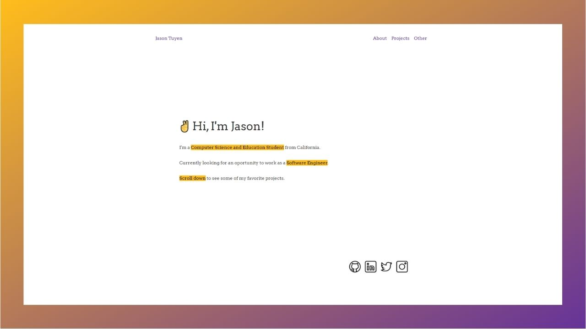
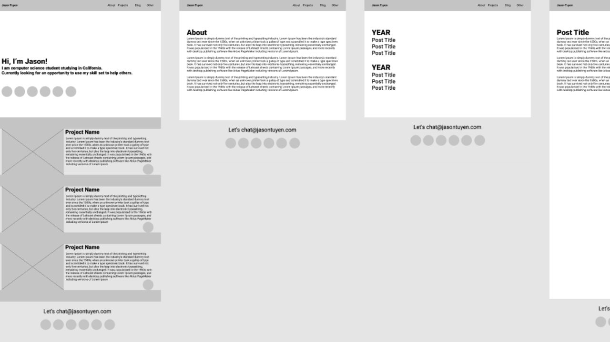

My personal website that you're currently viewing.

[GitHub Repo Link](https://github.com/JasonTuyen/personal-site)

## Project Summary
I decided to make a (new) personal website to better show off my skills and interests. 
The main tool that I used to build this website was [Gatsby](https://www.gatsbyjs.com/) because it's a well-documented and in-demand React based framework.
On top of being an in-demand skill, Gatsby websites can easily be deployed to [Netify](https://www.netlify.com/) and uses GraphQL to easily pull information.

## Project Requirements
* Functions as both my homepage and online project portfolio
* Quick and cheap deployment (Final Price: $7.99 per month, everything was free except for my domain)
* Simple design and easy to navigate
* Showcases my skills and my interests

## Project Thoughts
I made my first website in 2016 using only HTML+CSS.
My first website was a tribute to my favorite eSports team, Team Liquid.
The website was pretty bad, but I learned a lot from it and it's actually [still up on my GitHub page](https://github.com/JasonTuyen/TLWIN/blob/master/README.md).

The second website that I built was an e-commerce website back in 2018.
It was built using Wordpress, WooCommerce, the Elementor Plugin and hosted with Namecheap.
You can read more about that e-commerce project by clicking on [this link](/posts/nobletricksters/).

The third website that I created was my personal resume website.
It was created in 2019 using HTML+CSS and hosted with GitHub's Static Site Hosting.
It was never really finished because I started my first job at that time, so there wasn't much free time to complete it.

The fouth website is the current one that you are viewing right now and in my opinion, it's my favorite so far.

Here's a screenshot of my first original personal resume website:

Here's a screenshot of my current personal website:

This project was built mainly with GatsbyJS and some light HTML+CSS.
Most of the design was handled thanks to a Gatsby plugin called [Typography](http://kyleamathews.github.io/typography.js/)
The homepage was designed by myself, below is a Figma mockup that I made for my homepage and website:

### Research
I looked to many different websites for inspirtations and to determine how others were going about builing their websites.

It seemed that most people turned to Wordpress and other website building services like Squarespace.
I can see the attraction of a website builder: they're quick and easy.
However, I wanted to keep my costs low, so I turned to coding my own website from scratch.

I have coded a few websites from scratch before and they were coded in HTML+CSS without the use of a framework.
I knew I would have some tedious work ahead of me if I wanted to build a new website from scratch.
That's when I ran into [Brittany Chang's website](https://brittanychiang.com/) which lead me to Gatsby.

Gatsby is a reach based framework that fulfilled my most important requirement: quick and cheap deployment.

### Design
After desciding how I would build my website, I set out to create a rough draft design.
I used Figma to design my wireframe mockups and was able to create mockups in a few hours.
As you can see, in the end I didn't copy the design exactly, but rough drafts are more of a guideline and estimate anyways.

During this phase I also decided how many pages I would have and how the layout of the pages will look like.
My original draft was 5 pages (homepage, about page, project page, blog page, and other-misc page).
In the final result I had 4 pages (homepage, about page, project page, and other-misc page).
Here's the original Figma sketchesgat

I also had a color scheme in my mockup that I changed up in the final result since I found out about Typography.
I also decided that pink was a hard color to see, so I decided to use purple in the final design.

### Development
I did all my coding on Visual Studio Code (my favorite text editor).
I mainly followed the Gatsby quick start documentation and coupled with a couple Google searches was more than enough to get this website up and running.

## Final Project Thoughts
There were very few challenges to deal with in this projcet. 
Gatsby, HTML, and CSS has an active community of helpers and documentation so most of my issues were solved easily with Google.

As a result of this project, I learned to use GatsbyJS and how to host a website with Netify. 
I also learned how to use GraphQL to pull information from markdown files, so that I can have better project posts.
I also got to brush up on some old skills like HTML+CSS and Figma for mockups.

I plan to routinely update and grow this website as I grow myself. 
My next future development plan for this website is to add a toggable dark/light mode.

## Credits
* [Netify hosting](https://www.netlify.com/)
* [Brittany Chang's website](https://brittanychiang.com/)
* [Gatsby quick-start documentation](https://www.gatsbyjs.com/docs/quick-start/)
* [GrandView Theme from Typography.js](http://kyleamathews.github.io/typography.js/)